<!-- animated contribution graph: real data, boxes reveal cell by cell
     (regenerated daily by .github/workflows/update-profile-art.yml) -->

<h3><code>ani@github ~ $ ./contributions.sh</code></h3>

 
 

<!-- portrait (left) + info card (right). both svgs are 840x880 so equal widths give equal heights.
     portrait: python scripts/prep_photo.py <photo.jpg> && python scripts/make_ascii_svg.py
     info card: edit ROWS in scripts/make_info_card.py, then python scripts/make_info_card.py -->

<h3><code>ani@github ~ $ whoami</code></h3>

<table>
<tr>
<td valign="top"></td>
<td valign="top"></td>
</tr>
</table>

 
 

<!-- wide stats card, auto-refreshed daily by the same workflow -->

<h3><code>ani@github ~ $ ./stats.sh</code></h3>

 
 

<h3><code>ani@github ~ $ ./links.sh</code></h3>

 

