 

 
 

<!-- portrait (left) + "Now" card (right). both svgs are 840x880 so equal widths give equal heights.
     portrait: python scripts/prep_photo.py <photo.jpg> && python scripts/make_ascii_svg.py
     card: edit ROWS / ASKS in scripts/make_info_card.py (top-languages bar refreshes daily) -->

<h3><code>ani@github ~ $ ./about.sh</code></h3>

<table>
<tr>
<td valign="top"></td>
<td valign="top"></td>
</tr>
</table>

 

<h3><code>ani@github ~ $ ./impact.sh</code></h3>

 
 

<h3><code>ani@github ~ $ ./stack.sh</code></h3>

 
 

<h3><code>ani@github ~ $ ls ./projects</code></h3>

<table>
<tr>
<td></td>
<td></td>
</tr>
<tr>
<td></td>
<td></td>
</tr>
</table>

<b>🔧 Selected engineering work</b>

 

**Graphics (C++)**
- [2d-rasterizer-blending](https://github.com/anikash1232/2d-rasterizer-blending): software rasterizer implementing the full Porter-Duff compositing model, all twelve blend modes over premultiplied pixels, with span blending templated on the mode so the dispatch switch folds away at compile time
- [2d-rasterizer-shapes](https://github.com/anikash1232/2d-rasterizer-shapes): canvas primitives, line clipping and coverage-based anti-aliasing

**Systems (C)**
- [c-string-vector-library](https://github.com/anikash1232/c-string-vector-library): generic dynamic array and string types over `malloc`, with an allocation-guard layer
- [c-line-sorter](https://github.com/anikash1232/c-line-sorter): lines of unknown length into growing heap buffers
- [c-hex-and-parity-tools](https://github.com/anikash1232/c-hex-and-parity-tools): encoder/decoder pairs with bit-level parity checking

**Object-oriented design (Java)**
- [dungeon-crawler](https://github.com/anikash1232/dungeon-crawler): procedurally generated JavaFX dungeon crawler, ~1,200 lines, with polymorphic collision resolution
- [adapter-pattern-library](https://github.com/anikash1232/adapter-pattern-library): UNC campus walking directions, adapting a routing service to a buildings API
- [robot-control-simulator](https://github.com/anikash1232/robot-control-simulator): decorator-pattern robot customization with a composed JavaFX visual

**Web**
- [hydration-calculator](https://github.com/anikash1232/hydration-calculator): temperature-adjusted daily water intake (Next.js, shadcn/ui)
- [pixel-art-maker](https://github.com/anikash1232/pixel-art-maker): canvas editor with drawing logic fully separated from the DOM
- [url-shortener-orm](https://github.com/anikash1232/url-shortener-orm): FastAPI over an ORM, wired with dependency injection

 

<h3><code>ani@github ~ $ git log --career</code></h3>

 
 

<!-- latest public commits, rebuilt daily by .github/workflows/update-profile-art.yml -->

<h3><code>ani@github ~ $ git log --oneline -5</code></h3>

 
 

<!-- animated contribution graph + stats: real data, rebuilt daily by the same workflow -->

<h3><code>ani@github ~ $ ./contributions.sh</code></h3>

 

 
 

 

