


 

<a href="https://linkedin.com/in/anikash1"></a>
<a href="https://github.com/anikash1232"></a>
<a href="mailto:anirudh.vpk@gmail.com"></a>

 
 

<!-- portrait (left) + "Now" card (right). both svgs are 840x880 so equal widths give equal heights.
     portrait: python scripts/prep_photo.py <photo.jpg> && python scripts/make_ascii_svg.py
     card: edit ROWS / ASKS in scripts/make_info_card.py (top-languages bar refreshes daily) -->

<h3><code>ani@github ~ $ ./about.sh</code></h3>

<table>
<tr>
<td valign="top"></td>
<td valign="top"></td>
</tr>
</table>

 

<h3><code>ani@github ~ $ ./impact.sh</code></h3>

 
 

<h3><code>ani@github ~ $ ./stack.sh</code></h3>

 
 

<h3><code>ani@github ~ $ ls ./projects</code></h3>

<table>
<tr>
<td><a href="https://uncworkflows.vercel.app/"></a></td>
<td><a href="https://calendargen.up.railway.app/"></a></td>
</tr>
<tr>
<td><a href="https://landed-pi.vercel.app/"></a></td>
<td><a href="https://github.com/anikash1232/pipeline-automation"></a></td>
</tr>
</table>

 
 

<h3><code>ani@github ~ $ git log --career</code></h3>


 
 

<h3><code>ani@github ~ $ ls ./more-repos</code></h3>

<table>
<tr>
<td><a href="https://github.com/anikash1232/2d-rasterizer-blending"></a></td>
<td><a href="https://github.com/anikash1232/2d-rasterizer-shapes"></a></td>
</tr>
<tr>
<td><a href="https://github.com/anikash1232/c-string-vector-library"></a></td>
<td><a href="https://github.com/anikash1232/c-line-sorter"></a></td>
</tr>
<tr>
<td><a href="https://github.com/anikash1232/c-hex-and-parity-tools"></a></td>
<td><a href="https://github.com/anikash1232/dungeon-crawler"></a></td>
</tr>
<tr>
<td><a href="https://github.com/anikash1232/adapter-pattern-library"></a></td>
<td><a href="https://github.com/anikash1232/robot-control-simulator"></a></td>
</tr>
<tr>
<td><a href="https://github.com/anikash1232/hydration-calculator"></a></td>
<td><a href="https://github.com/anikash1232/pixel-art-maker"></a></td>
</tr>
<tr>
<td><a href="https://github.com/anikash1232/url-shortener-orm"></a></td>
<td><a href="https://github.com/anikash1232?tab=repositories"></a></td>
</tr>
</table>

 

<!-- latest public commits, rebuilt daily by .github/workflows/update-profile-art.yml -->

<h3><code>ani@github ~ $ git log --oneline -5</code></h3>

 
 

<!-- animated contribution graph + stats: real data, rebuilt daily by the same workflow -->

<h3><code>ani@github ~ $ ./contributions.sh</code></h3>

 

 
 

 

<a href="https://linkedin.com/in/anikash1"></a>

